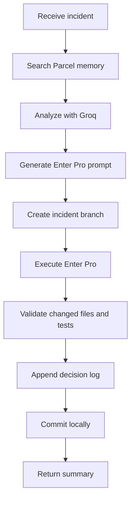

# AI Incident Resolution Agent

A FastAPI and LangGraph service that turns a production incident into a documented, tested, locally committed
remediation in an existing Employee Portal repository. It searches Parcel memory, uses Groq for evidence-based
analysis and implementation planning, delegates the edit to Enter Pro, validates the result, and records an audit trail.

The workflow intentionally **does not push**. A human reviews the local incident branch and pushes it later.

## Workflow



Each node is small and dependency-injected. External systems live under `app/integrations`, Pydantic boundary
models under `app/models`, prompt policy under `app/prompts`, and the extensible graph state under `app/graph`.

## Configuration

Copy `.env.example` to `.env` and provide the real Parcel, Groq, Enter Pro, and Employee Portal values. Important:

- `EMPLOYEE_PORTAL_PATH` must point to an existing local Git repository.
- `VALIDATION_COMMAND` is run inside that repository after Enter Pro edits it.
- `ENABLE_GIT_PUSH` defaults to `false` and is retained as an explicit safety setting; this workflow never invokes push.
- The Parcel adapter posts `{"query": "...", "limit": 8}` to `PARCEL_BASE_URL + PARCEL_SEARCH_PATH`.
- The Enter Pro adapter posts `{"prompt": "...", "project_path": "..."}` to `ENTERPRO_URL`.

If your existing Parcel or Enter Pro contract differs, only its adapter needs to change.

## Run locally

```bash
python -m venv .venv
# Activate the virtual environment, then:
pip install -r requirements.txt
uvicorn app.main:app --reload
```

Resolve an incident:

```bash
curl -X POST http://localhost:8000/api/v1/incidents/resolve \
  -H "Content-Type: application/json" \
  -d '{"incident":"Users cannot update their profile after the validation rollout"}'
```

The response contains `branch_name`, `files_modified`, `documentation_updated`, `commit_hash`, validation details,
and a summary. Failures from external integrations or validation return an error without pushing anything.

## Testing and visualization

```bash
pytest -q
python -m scripts.generate_graph
```

The visualization script writes `docs/incident_workflow.mmd`. Every successful target-repository run appends its
evidence and decisions to `docs/agent_decisions.md` before committing all changes locally.

## Docker

Set `EMPLOYEE_PORTAL_PATH_HOST` to the host Employee Portal directory, then run `docker compose up --build`.
The target repository is mounted into the container at `/workspace/employee-portal`.
