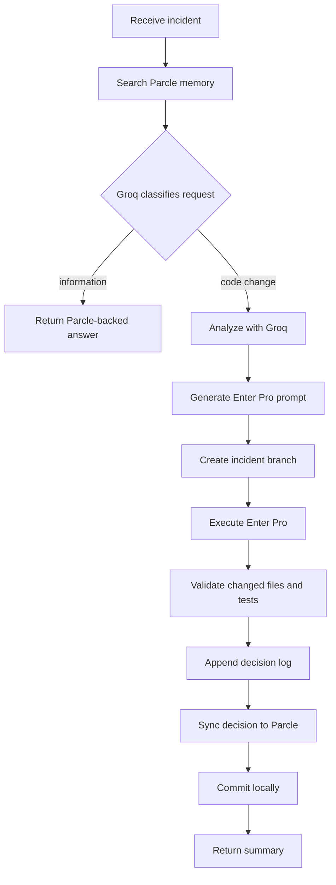

# AI Incident Resolution Agent

A FastAPI and LangGraph service that turns a production incident into a documented, tested, locally committed
remediation in an existing Employee Portal repository. It searches Parcle memory, uses Groq for evidence-based
analysis and implementation planning, delegates the edit to Enter Pro, validates the result, and records an audit trail.

The workflow intentionally **does not push**. A human reviews the local incident branch and pushes it later.

## Workflow



Each node is small and dependency-injected. External systems live under `app/integrations`, Pydantic boundary
models under `app/models`, prompt policy under `app/prompts`, and the extensible graph state under `app/graph`.

Parcle is the repository memory layer. The one-time seed command uploads the target repo's `README.md`,
`API_DOCUMENTATION.md`, and `PARCLE_MEMORY.md` with `client.ingest_file(...)`. Each successful incident decision is
also written back with `client.ingest_dialog(...)`. At runtime, every user request searches Parcle first; Groq then
decides from the request plus Parcle response whether this is an informational answer or a repo-level code change.
Enter is called only for repo-level code-change requests.

## Configuration

Copy `.env.example` to `.env` and provide the real Parcle, Groq, Enter Pro, and Employee Portal values. Important:

- `EMPLOYEE_PORTAL_PATH` must point to an existing local Git repository.
- `VALIDATION_COMMAND` is run inside that repository after Enter Pro edits it.
- `ENABLE_GIT_PUSH` defaults to `false` and is retained as an explicit safety setting; this workflow never invokes push.
- `PARCLE_API_KEY` is used by the official `parcle` SDK.
- `PARCLE_USER_ID` defaults to `system_user`. Seed this user once with the Employee Portal documentation, then every incident search and decision sync uses the same memory user.
- `ENTERPRO_COMMAND` optionally overrides the Enter Code command. Leave it blank to use the built-in command:
  `enter -p <prompt> -permission-mode acceptEdits -output-format json`.
- `ENTERPRO_WORKSPACE_ID` is passed to the command template and exported as `ENTERPRO_WORKSPACE_ID`.
- `ENTERPRO_URL` is still supported as a fallback HTTP mode if no CLI command is configured.

If your existing Parcle or Enter Pro contract differs, only its adapter needs to change.

### Enter Pro repo access

The graph creates a local incident branch in `EMPLOYEE_PORTAL_PATH`, then calls Enter Pro with that same path. In CLI
mode, Enter gets code access in one of two ways:

- Local repo access: run this service on the same machine/container where the Employee Tracker repository is mounted.
  Set `EMPLOYEE_PORTAL_PATH` to that checkout. Docker does this by mounting `EMPLOYEE_PORTAL_PATH_HOST` to
  `/workspace/employee-portal`.
- Enter workspace/GitHub access: if Enter should operate through a workspace, connect GitHub in Enter Pro, authorize
  the Employee Tracker repository, and set `ENTERPRO_WORKSPACE_ID`. The code agent binary is `enter`; `enter-cli` is
  for platform management, and `enter` with no `-p` opens the interactive terminal UI. Numeric workspace IDs are sent
  to Enter with `-workspace-id`; workspace names are sent with `-workspace`.

Optional command override if you want to force npx:

```dotenv
ENTERPRO_COMMAND=npx --no-install enter -p "{prompt}" -permission-mode acceptEdits -output-format json -workspace-id "{workspace_id}"
```

When `ENTERPRO_API_KEY` is set, the built-in command passes it to Enter with `-api-key` and also exports
`ENTER_API_KEY`.

Verify the command from the same shell/container that will run LangGraph:

```bash
python -m scripts.check_enter
```

When running with Docker, the Enter CLI must be installed inside the image/container. A CLI installed only on the host
machine is not visible to the `incident-agent` container. While wiring up Enter for the first time, running locally with
`uvicorn app.main:app --reload --port 8001` is usually simpler than Docker because it uses your host PATH.

## Seed Parcle memory

The Employee Portal root must contain exactly these canonical context files:

- `API_DOCUMENTATION.md`
- `PARCLE_MEMORY.md`
- `README.md`

Validate them without writing anything:

```bash
python -m scripts.ingest_parcle --dry-run
```

Then perform the one-time SDK ingestion into `PARCLE_USER_ID`:

```bash
python -m scripts.ingest_parcle
```

Use `--project-path C:/path/to/employee-portal` to override `EMPLOYEE_PORTAL_PATH`.
The script submits the complete Markdown files with `client.ingest_file(user_id=PARCLE_USER_ID, file=...)`.
Parcle may apply its own internal chunking/indexing. Treat this as a one-time seed step for the shared system memory;
rerun only when you intentionally want Parcle to ingest refreshed source documentation.

### Where memory is updated

The searchable memory is not stored in this agent repository. It is stored in the remote Parcle service under:

```text
PARCLE_USER_ID=system_user
```

Separately, the human-readable local audit trail is stored at `<EMPLOYEE_PORTAL_PATH>/docs/agent_decisions.md`.
After every successful incident, that decision is both appended to the local audit file and written into Parcle as
dialog memory with `client.ingest_dialog(...)` so later searches can use it.

## Run locally

```bash
python -m venv .venv
# Activate the virtual environment, then:
pip install -r requirements.txt
npm install
python -m scripts.check_enter
uvicorn app.main:app --reload --port 8001
```

Resolve an incident:

```bash
curl -X POST http://localhost:8001/api/v1/incidents/resolve \
  -H "Content-Type: application/json" \
  -d '{"incident":"Users cannot update their profile after the validation rollout"}'
```

The response contains `branch_name`, `files_modified`, `documentation_updated`, `commit_hash`, validation details,
and a summary. Failures from external integrations or validation return an error without pushing anything.

## Testing and visualization

```bash
pytest -q
python -m scripts.generate_graph
```

The visualization script writes `docs/incident_workflow.mmd`. Every successful target-repository run appends its
evidence and decisions to `docs/agent_decisions.md`, syncs the decision to Parcle, and then commits locally.

## Docker

Set `EMPLOYEE_PORTAL_PATH_HOST` to the host Employee Portal directory, then run `docker compose up --build`.
The target repository is mounted into the container at `/workspace/employee-portal`.
